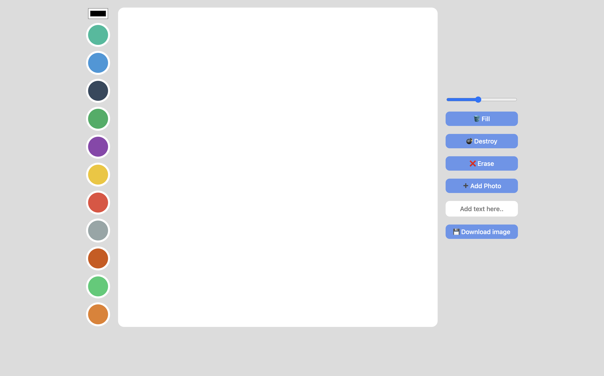

# Meme-Maker-Clone
Painting Board & Meme Maker

## 🔗 Demo

## 🖥 Preview

## 🔥 Stack

### Front-end

  

## ✅ Packages

- [x] HTML5
- [x] CSS3
- [x] JavaScript
- [x] VSCode

## 📖 Theory

- [x] Context
- [x] Draw
- [x] Paint
- [x] Eraser
- [x] Change Color
- [x] Change Line Width
- [x] File Upload
- [x] Image Download
- [x] Cursor Tracker

## 📱 View

- [x] Canvas
- [x] Palette
- [x] File Uploader
- [x] Reset Button
